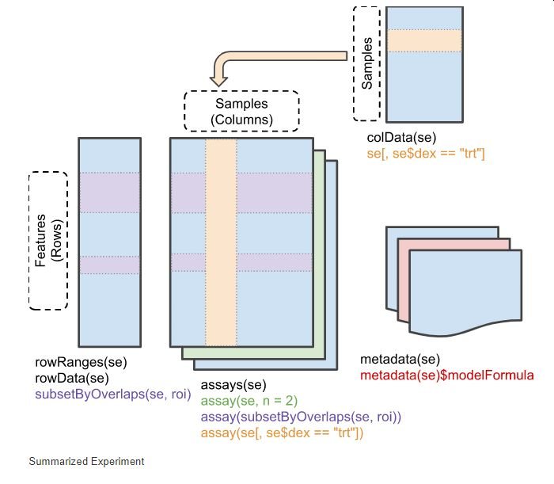

# BioC Owl: Learning about Bioconductor Objects

This is a tutorial package that familiarizes intermediate R users with aspects of Bioconductor and introduces them to the Bioconductor package ecosystem. 

## Learning SummarizedExperiment

The `SummarizedExperiment` class is one of the fundamental ways to store data in Bioconductor, whether it be protein expression, RNASeq data, or single cell data. `SummarizedExperiment` contains information about a studies' experimental design, and information about the genes or entities that the assay data maps to.




### Learning Objectives

- **Learn** about Bioconductor objects and how they enable complex analysis
- **Learn** about the components of a `SummarizedExperiment` object and how they work together
- **Extract** experimental information about a `SummarizedExperiment` object using `metadata()`
- **Learn** and **Utilize** sample information about the experimental design of a `SummarizedExperiment` using `colData()`
- **Learn** and utilize genomic information in `rowData()` to select rows based on genomic coordinates
- **Construct** complex subsetting queries using `colData()` (selecting samples based on experimental design) and `rowData()` (selecting reads within a Genomic range using `subsetByOverlap()`)
- **Utilize** the `Deseq2` package to run differential expression analysis using a `SummarizedExperiment` and a experimental design (specified by a formula)


### Installing

```
install.packages("remotes")
remotes::install_github("laderast/biocowl")

```

### Run the Tutorial

```
library(biocowl)
learn_summarized_experiment()
```

### Acknowledgements

Based on discussions with Kate Hertweck about how to teach Bioconductor. Parts of this tutorial are derived from https://bioconductor.org/packages/release/bioc/vignettes/SummarizedExperiment/inst/doc/SummarizedExperiment.html


# Code of Conduct
  
Please note that the `biocowl` project is released with a [Contributor Code of Conduct](https://contributor-covenant.org/version/2/0/CODE_OF_CONDUCT.html). By contributing to this project, you agree to abide by its terms.
