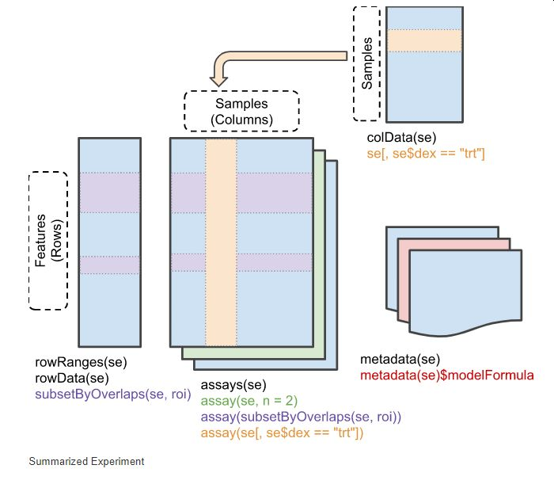

```{r setup, include=FALSE}
library(learnr)
knitr::opts_chunk$set(echo = FALSE)
library(SummarizedExperiment)
library(airway)
data(airway)
library(dplyr)
```


## Learning Objectives

- *Learn about* the structure of a common Bioconductor Object, `SummarizedExperiment`
- *Learn about* slots in Bioconductor Objects
- *Learn about* the `colData` slot in a `SummarizedExperiment`
- *Learn about* the `assay` slot
- *Subset and query* data by using `colData` and `assayData` together
- *Visualize* an `SummarizedExperiment` object

### Welcome to Bioconductor!

What is Bioconductor? 

Bioconductor is a set of R Packages that is made for high-throughput bioinformatics analysis, with a focus on OMICs data, such as genomics, proteomics, images, and transcriptomics. 

What makes Bioconductor so powerful is that these packages share data structures called *objects*. That means that you can take the output of one package and immediate use it as an input to other packages. [need example here]

However, getting to the point of understanding how these *objects* work can be a real barrier to getting started in Bioconductor. 


### Installing Bioconductor

Part of what makes Bioconductor so confusing to install is that it has its own installer, which lives in a package called `BiocManager`. So, the first step to install Bioconductor packages is to use `BiocManager::install()` instead of `install.packages`.

We're going to install the `SummarizedExperiment` package and the `airway` dataset with `BiocManager::install()`:

```
install.packages("BiocManager")
BiocManager::install(c("SummarizedExperiment", "airway"))

```

## Review: working with `list`s

Unfortunately, most `Bioconductor` packages do not have a tidy-style workflow. That means you'll be using some base-R concepts to do things.

So, in case you need it, here is a review of `list`s, which are at the heart of almost all Bioconductor objects.

We'll start with a making a list and understand different properties about it.

```{r list1, exercise=TRUE}
my_list <- list(cat_names = c("Morris", "Julia"), 
                hedgehog_names = "Spiny", 
                dog_names = c("Rover", "Spot"))

my_list
```
`my_list` has some properties and ways to access things in it that are really useful. The first is that `my_list` has a `length()`

```{r list2, exercise=TRUE}
my_list <- list(cat_names = c("Morris", "Julia"), 
                hedgehog_names = "Spiny", 
                dog_names = c("Rover", "Spot"))

length(my_list)
```
Additionally, because the elements are named, it also will give you the names:

```{r list3, exercise=TRUE}
my_list <- list(cat_names = c("Morris", "Julia"), 
                hedgehog_names = "Spiny", 
                dog_names = c("Rover", "Spot"))

names(my_list)
```

We can access a single element in the list using a name:

```{r list4, exercise=TRUE}
my_list <- list(cat_names = c("Morris", "Julia"), 
                hedgehog_names = "Spiny", 
                dog_names = c("Rover", "Spot"))

my_list$cat_names
```
You can also access an element using the `[[]]` (double brackets) accessor:

```{r list5, exercise=TRUE}
my_list <- list(cat_names = c("Morris", "Julia"), 
                hedgehog_names = "Spiny", 
                dog_names = c("Rover", "Spot"))

my_list[[1]]
```

You can also pass a name here as a `character`:

```{r list6, exercise=TRUE}
my_list <- list(cat_names = c("Morris", "Julia"), 
                hedgehog_names = "Spiny", 
                dog_names = c("Rover", "Spot"))

my_list[["hedgehog_names"]]
```
Beware of the difference between `[[]]` and `[]`. The `[]` accessor returns a list of length 1 that is named `hedgehog_names`, not the element in it:

```{r list7, exercise=TRUE}
my_list <- list(cat_names = c("Morris", "Julia"), 
                hedgehog_names = "Spiny", 
                dog_names = c("Rover", "Spot"))

my_list["hedgehog_names"]
```
In most cases, you want to use `[[]]`.

### Your Turn

Find the length of the `cat_names` element in `my_list`:

```{r list8, exercise=TRUE}
my_list <- list(cat_names = c("Morris", "Julia"), 
                hedgehog_names = "Spiny", 
                dog_names = c("Rover", "Spot"))

length(-------)
````

```{r list8-solution}
my_list <- list(cat_names = c("Morris", "Julia"), 
                hedgehog_names = "Spiny", 
                dog_names = c("Rover", "Spot"))

length(my_list$cat_names)
````


### `data.frame`s are list-like

One last note. You might know that you can access columns in a `data.frame` using `$`. This is because a `data.frame` is a special *instance* of a list.

Hence, you can use all of the above accessors to manipulate a `data.frame`.

```{r echo=TRUE}
data(mtcars)

length(mtcars)

mtcars$mpg

mtcars[[1]]

mtcars[["mpg"]]
```

The base-R way to subset a `data.frame` is to pass logical vectors as indices to the `data.frame`. Knowing this helps you subset Bioconductor objects easier.

```{r echo=TRUE}
data(mtcars)

mtcars[mtcars$cyl == 4,]
```

## Walk Before We Can Run

You might be impatient to load your data into Bioconductor. 

We should learn about how the objects work before we try to load our data. They are complicated, and starting by loading actually makes things more difficult to understand.

Let's take a guided tour of a commonly used object type in Bioconductor called `SummarizedExperiment`. This object type is used in a lot of expression analysis, including that of Single Cell Transcriptomics.

To do so, we need to load the `SummarizedExperiment` package, and the `airway` dataset.

```{r loadbioc, exercise=TRUE}
library(SummarizedExperiment)
library(airway)
data(airway)
```

### Reading the print output of SummarizedExperiment

Let's look at the `airway` experiment. If we just type in `airway`, we'll get some simple info about the experiment.

```{r airway, exercise=TRUE}
airway
```

### Check Yourself

How many rows are in the `RangedSummarizedExperiment`?

What entity does each row correspond to? (hint: look at the `rownames`.)

## Anatomy of a SummarizedExperiment

```{r}

```

## Learning about the experiment with `metadata()`

We don't know anything about the `airway` experiment. 

Good `SummarizedExperiment` objects will have some built in documentation about the experiment. This is stored in a slot called `metadata`, which we can access using the `metadata()` function.

Notice that it returns a list. We'll need to 

```{r}
md <- metadata(airway)
class(md)
```
```{r}
md[[1]]
```

```{r}
abstract(md[[1]])

```

## Access sample metadata using `colData`

We can access information about the samples used in this experiment using `colData()`. This experiment was run on multiple cell lines.

```{r}
colData(airway) %>%
  knitr::kable()
```

### Check Yourself

```{r sample1, echo=FALSE}
question("How many cell lines were used in this study?",
  answer("8", message= "Close. Look at the `cell` column. Are there any duplications?"),
  answer("4", correct=TRUE),
  answer("2", message="Look at the `cell` column - how many unique values are there?")
)
```

```{r sample2, echo=FALSE}
question("Is this study a paired design?",
  answer("Yes, and there are treated and untreated samples", correct=TRUE),
  answer("No - all samples are controls")
)
```

## assays()

The actual experimental assay measurements can be accessed by using the `assays()` method on our object:

```{r assays, exercise=TRUE}
assays(airway)
```
So, there is a list object that can be accessed in `assays()` with one slot. There's one object in this list called `counts`.

```{r assays2, exercise=TRUE}
head(assays(airway)$counts)
```

One thing to keep in mind is that the list that is accessed with `assays()` can have multiple slots. This is especially handy if there are multiple runs or multiple assays for the samples. One example might be multiple timepoints.

However, there is a *restriction* that all of the objects in here must have the same column dimensions. That is, they must have the same columns with the same sample ids as the others. 

We've seen that this slot contains a matrix or a `data.frame`. However, it can also be other representations. Most notably, since single cell transcriptomics is sparse in terms of the number of reads mapped to each gene, the `SparseMatrix` representation is often used. This saves a lot of memory when storing these objects.   

### Check Yourself

```{r question1, echo=FALSE}
question("What do the rows and columns correspond to in this matrix?",
  answer("Rows are Ensembl transcripts, columns are samples", message= "Close, but the rows actually correspond to Ensemble Genes"),
  answer("Rows are Ensemble Genes, columns are samples", correct=TRUE),
  answer("Rows are samples, columns are Ensemble Genes", message="I think you're mixing up the columns and genes here")
)
```


```{r question2, echo=FALSE}
question("What does each cell in the matrix correspond to?",
  answer("Immunofluoresence Value", message= "Hmm, remember we're talking about transcriptomics here"),
  answer("Number of reads that map to that gene", correct=TRUE)
)
```

## Actually doing stuff

Okay, you're probably getting a little impatient on how to get stuff out of the database.

### Subsetting Data to Specific Samples

The great thing about `colData` is that we can use information in it to subset samples in the dataset. We can access the variables in `colData` directly using the `$` operator.

```{r subset1, exercise=TRUE}
airway$dex
```
So, we can use this as filtering criteria. Say, we only want those treated (`trt`) samples.

```{r subset2, exercise = TRUE}
airway[,airway$dex == "trt"]
```

### Exercise

Select those samples that have an `avgLength` greater than 100.

```{r aveLength, exercise = TRUE}
airway[, airway$----- < ---]

```

```{r aveLength-solution}
airway[, airway$avgLength > 100]

```

## rowData

Our `SummarizedExperiment` has one additional dimension we can query. Each count is mapped to a specific gene boundary, and the counts in our assay() list are aggregated at the Ensemble Gene Level.

So each row of our assay matrix is mapped at the genomic coordinates level, which means we can subset our data at this level.

```{r}
rowInfo <- rowRanges(airway)

rowInfo

names(rowInfo)[1:10]
```

```{r}
rowInfo[1]

slotNames(rowInfo)
```

## Subsetting Data to Specific Genes

Say we had a set of genes and their Ensembl Ids


### Subsetting Data to Specific Ranges

## Doing Analyses with `SummarizedExperiment` objects

### Experimental Design

Now we've looked at `SummarizedExperiment`. However, to do more useful analysis, such as Differential Expression Analysis, we'll need to make Bioconductor aware of the experimental design of our `SummarizedExperiment`. That way, it knows which sets of samples to compare with each other. 

An experimental design maps the sample metadata columns from `colData` to a *design matrix*. We do that by providing a `formula`. In our case, our design is:

`~ cell + trt`

## Acknowledgements

Parts of this tutorial are derived from https://bioconductor.org/packages/release/bioc/vignettes/SummarizedExperiment/inst/doc/SummarizedExperiment.html

### Give us feedback

